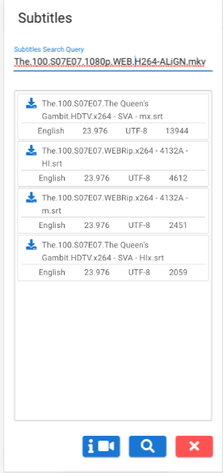

# kodi-remote-subtitles

### Working demo: [kodirs.cyou](http://kodirs.cyou)

## Motivation
English isn't my native language, and despite I can read/write, my verbal abilities lack. For example, sometimes it's difficult for me to understand spoken language. One way to improve it is by watching movies/series. But here's a catch. If I watch a movie without subtitles, I don't understand much. While I watch a movie with subtitles, I feel I am not engaged enough because I don't listen to a talk. So, I decided to write this POC application to overcome this limitation. You can watch a movie without subtitles, but if you didn't understand something, you easily read subtitles on your mobile phone. Or if you prefer you can read subtitles, before, the scene. Also, you can jump to the scene which you didn't understand and rewatch it again in an easy way. Once this app connected to the [Kodi](https://kodi.tv/) player, it synced with it together with subtitles relative to playing time. 

## Usage
There're two views, basic and advanced.
- ### Basic View
You can:
- turn on/off subtitles
- rewind by 15 seconds and turn on subtitles
- rewind or move forward by 15 seconds
- play/pause the movie.

UX is pretty self-explained.

- ### Advanced View
The main difference between **Basic View** is subtitles list which is synced with a movie. You can upload subtitles by uploading `*.srt` file from here or by [opensubtitles](https://www.opensubtitles.org/en/search/subs) [api](https://trac.opensubtitles.org/projects/opensubtitles) from subtitles view.

Available options:
- rewind or move forward by 15 seconds
- play/pause the movie.
- scroll to current subtitles
- pause and scroll to current subtitles
- display time within subtitles list (on/off)
- automatically scroll subtitles list to show current subtitles (on/off)
- manually enter delta in milliseconds if your subtitles not in a sync by constant value
- copy subtitles text to clipboard
- upload subtitles from a file

- ### Subtitles View
From this view you can search subtitles by using [opensubtitles api](https://trac.opensubtitles.org/projects/opensubtitles). 
 - To open this view, press  button located on the navigation bar
 - Write search query or use movie's name to fill it by pressing  button (movie must be selected to use this option)
 - Download subtitles

- ### Settings view
You obviously need to connect to the Kodi player before using this wonderful app. You can do it in the **Settings view** by open it pressing  button from the navigation bar. 
- **If navigation bar's buttons displayed in red, it means that application not connected to Kodi.**
- You must enable [Kodi Webserver](https://kodi.wiki/view/Webserver#Enabling_the_webserver) before connecting to it
- Enter `ip:port`, for example `192.168.1.8:9090` and press connect and save
- Sometimes browser can disconnect Kodi, usually it happens if your device will enter a sleep mode during the session. In this case all navigation bar's buttons will became red and reconnect button will appear . Press it to reestablish connection.

- ### Installation
Application can be installed on any HTTP server, but it can't work over HTTPS following this issue [Using insecure websocket connection from https loaded side, mixed content issue](https://stackoverflow.com/questions/62552412/using-insecure-websocket-connection-from-https-loaded-side-mixed-content-issue). 
- `git clone`
- `yarn run build`
- if it will be located not in root folder you must specify correct `publicPath` in file `vue.config.js` before building
- after finishing build, just upload files located in `dist` folder to your HTTP server.
- Built phase was tested with nodejs >= 14 but I guess that to some level older nodejs should work fine.

- ### Feedback
It's [POC](https://en.wikipedia.org/wiki/Proof_of_concept) application, so it can, and certanly will be buggy. If you have any problem/question please open an issue. I will try my best to help.

(c) Anatoly Tarnavsky
